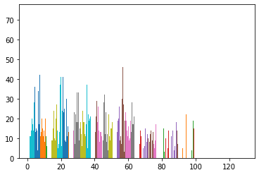
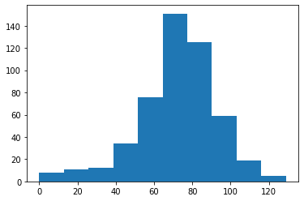

# Data_visualization_of_random_walk

Plot The DistriBution
All these fancy visualizations have put us on a sidetrack. 
What are the odds that you'll reach 60 steps high on the Empire State Building?
Basically, you want to know about the end points of all the random walks you've simulated. 
These end points have a certain distribution that you can visualize with a histogram.

# Output

